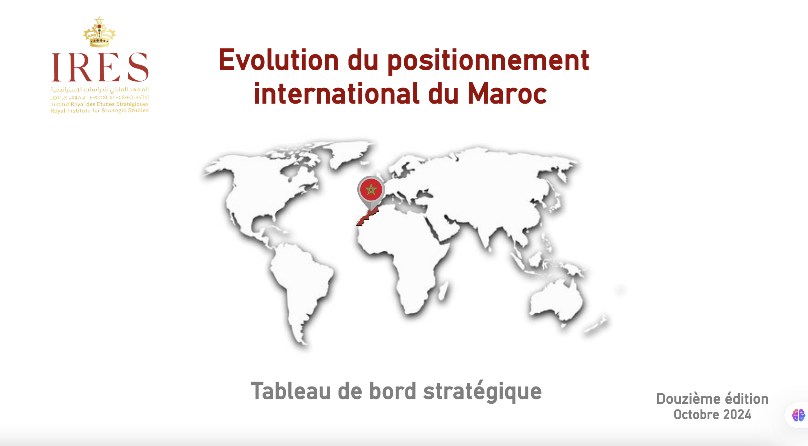
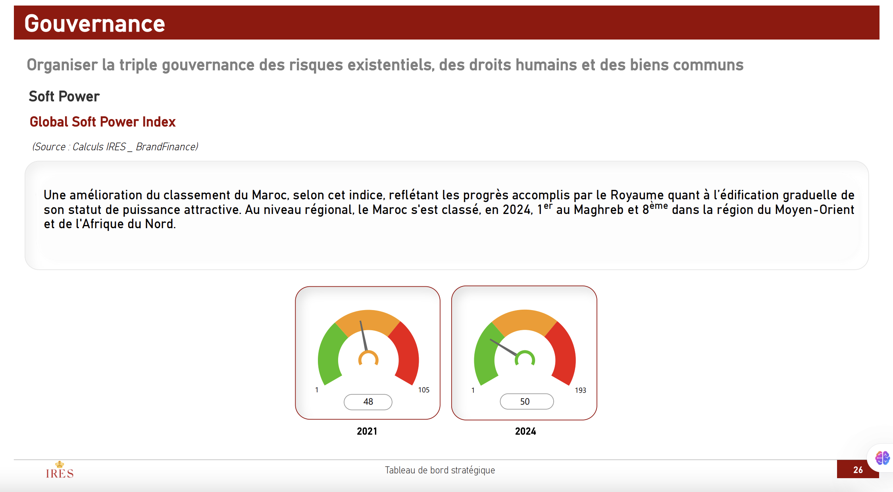

# Strategic Dashboard for IRES — Public Case Study

**Project:** Tableau de Bord Stratégique — 12ᵉ édition (IRES)  
**Role:** Data scientist / Data Visualization & Modelling  
**Public deliverable:** Final report (PDF) published by IRES — see 
official link below.

---

## 🔎 About this case study
I designed and developed the Power BI dashboard and visualizations used 
in the **12ᵉ édition du Tableau de Bord Stratégique** published by 
**Institut Royal des Études Stratégiques (IRES)**.  
This repository is a *portfolio case study* that summarizes the project, 
techniques used, and the public deliverable published by IRES.

> **Public report (IRES):**  
> 
[https://www.ires.ma/sites/default/files/docs_publications/tbs-12eme-edition.pdf](https://www.ires.ma/sites/default/files/docs_publications/tbs-12eme-edition.pdf)

---

## 🛠️ Skills & Techniques demonstrated

### 🧩 Project Data Architecture & Process Overview
Developed a **centralized data analytics system** tracking more than **200 strategic indicators** measuring Morocco’s international positioning across economic, social, and institutional dimensions.

### 🔹 Data Integration & Warehouse Design
Collected data from multiple **official sources** — IMF, World Bank, UNICEF, UNESCO, Bank Al-Maghrib, UNDP, FAO, and national statistics offices — into a **centralized data warehouse**.

The model included:
- A **fact table** for indicator measurements  
- **Dimension tables** for indicators, themes, and data sources  
- Supporting tables for definitions and analytical commentary  

This enabled **automation, scalability, and traceability** of each data update.

### 🔹 Automation & Power BI Integration
- Power BI connected directly to the data warehouse for **automated refreshes**  
- Incremental data loading reduced refresh times significantly  
- Analytical comment tables added qualitative context alongside metrics  

### 🔹 Simplified Data Model

Indicators ───▶ Measurements ───▶ Analysis_Comments ───▶ Definitions

---

## 📷 Screenshots
*(Excerpts from the publicly published report — not from the original 
`.pbix` file.)*

---

## ⚠️ Legal & ethical note
The final report and visuals are publicly available on IRES’s website 
(link above).  
This repository **does not** contain the original Power BI `.pbix` file, 
confidential datasets, or any internal proprietary material belonging to 
IRES.  

All images are excerpts from the publicly released report.  
For demonstration purposes only. For further details, please contact me 
for a private walkthrough or an anonymized replica.

---

## 📫 Contact
**Chaimaa Zyani**  
📧 zyanichaimaa@gmai.com
🔗 [[LinkedIn]](https://www.linkedin.com/in/chaimaa-zyani-a49480159/)
📄 [Portfolio](https://github.com/zyani-chaimaa/chaimaa-portfolio)
# 
IRES-PowerBI-case-study
Public case study of a Power BI dashboard developed for IRES (final report available on IRES website).
